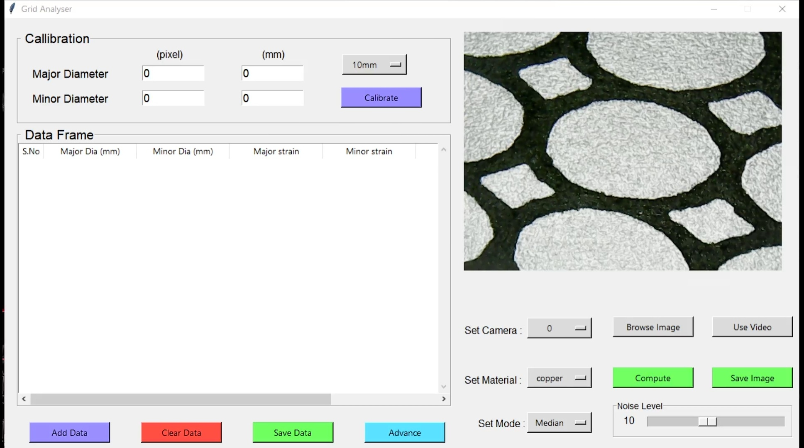
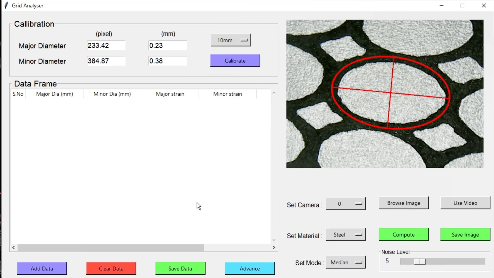
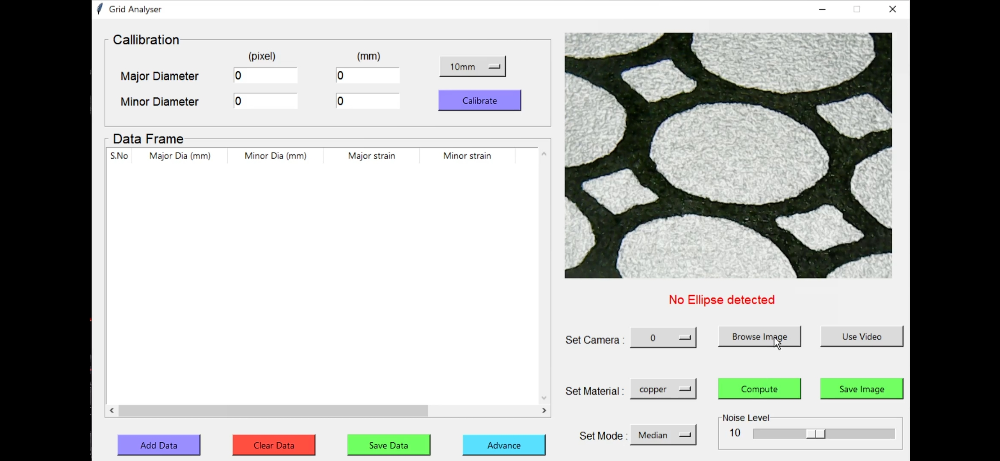
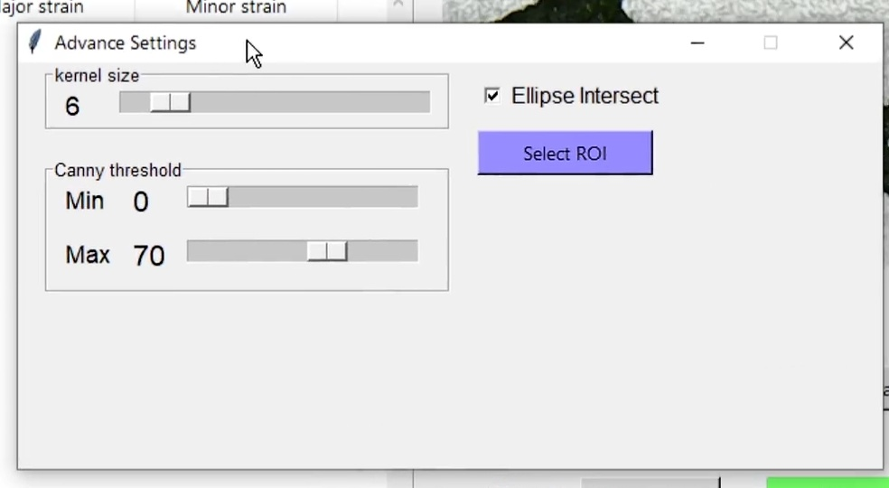
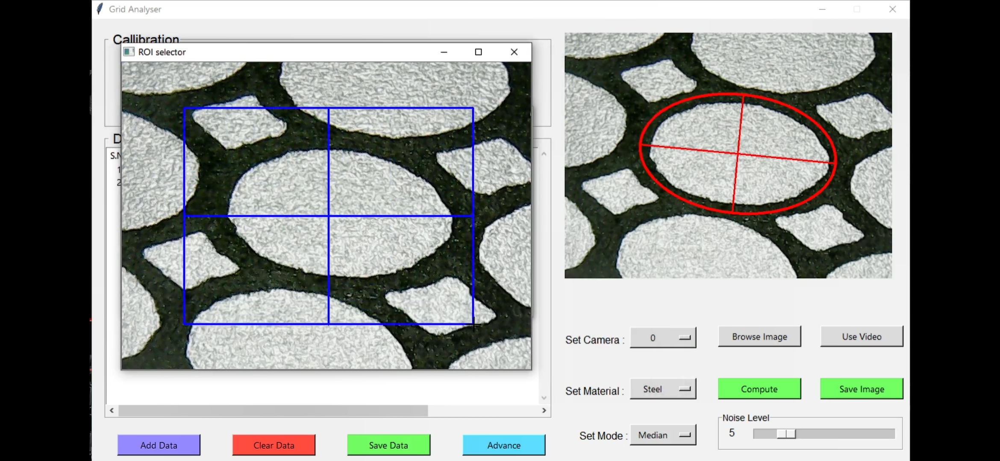
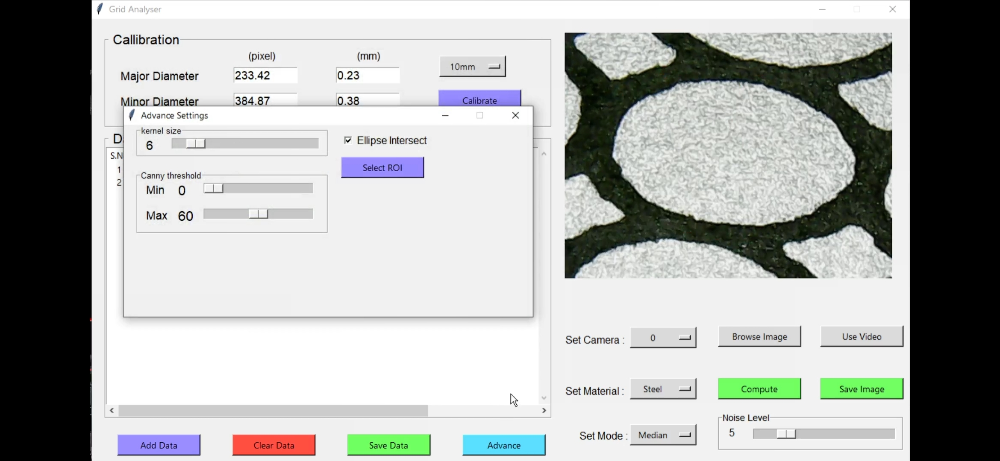

# Grid Analyser
An image processing based
software for surface strain analysis
in sheet metal forming.
## Description
Strain Analysis is conventionally performed by Circle Grid Analysis(CGA) , Grid Analyser software automates the process of ellipse detection involved in CGA. In CGA a grid of circles with 2mm to 5mm diameter is printed on a flat metal sheet, when the metal is deformed to the required shape circle deforms to ellipse, length of major and minor axes of these ellipse are required to calculate the surface strain, Grid Analyser automates this process thus providing strain values with high accuracy.Grid Analyser currently works with following metals with screen printed circular grids. 
* Copper
* Steel
* Aluminium
## Installation
If the git is installed in the system you can use the following command to clone the repository after navigating into the directory in which you wish to install software.

`git clone https://github.com/wrpankaj/Single-Point-Strain-Analysis-Softwares`

For the users without git installation you can download the zip file and extract it.After cloning or extracting the repository you open the main.exe to run the software.All the remaining files could be deleted unless you wish to add changes to the software.
## Features
* [Compute](#Compute)
* [Caliberate](#Caliberate)
* [Save_image](#Save_image)
* [Use_video](#Use_video)
* [Browse_image](#Browse_image)
* [Set_camera](#Set_camera)
* [Set_material](#Set_material)
* [Set_mode](#Set_mode)
* [Noise_level](#Noise_level)
* [Add_data](#Add_data)
* [Clear_data](#Clear_data)
* [Save_data](#Save_data)
* [Adavance](#Advance)
    * [Canny_threshold](#Canny_threshold)
    * [Ellipse_intersect](#Ellipse_intersect)
    * [Select_ROI](#select_ROI)

### Compute
when user clicks the compute button, process function from the image_process.py is called with current selected image either from video or browsed image.If the ellipse is detected it will be displayed in the gui as shown below.

Incase if no ellipse is detected the following warning will be shown.this warning will be displayed untill next compute call.

### Caliberate

This button lets the user to caliberate the constant that converts the pixels to millimeter(mm).In case of CGA user should caliberate using the circular grid of known dimensions and also user should select the correct endcap dimension using the drop down menue although its not compulsory but changing it after caliberation would effect the end results.caliberate also stores the diameter of circle which later be used to calculate the strain.The entry's to the left of calibrate not only show the output but also take the input from user, which is essential is user wants to caliberate.

### Save_image

User can save image that is being displayed in the window using the following feature, software lets user to save image in the following formats
* PNG
* JPG
* JPEG

### Use_video
This button sets the variable use_video to 1.Which shifts the GUI from any image that is being displayed to live video from the camera selected by the user.

### Browse_image
Browse Image feature enables user to load image for processing instead of choosing image from live video.Once user clicks Browse Image button user can select the image from Her/His File System.The supported file format's are same as Save Image file format's. 

### Set_camera
If user has multiple camera's connected to his system,this drop down menue lets him choose the camera.User must connect the camera before opening the main.exe,the applicaiton scans for camera's only once, as it is time consuming process.

### Set_material
A set of default values has been stored for each material,this lets user to work on different material's without having to worry about the material.selecting the material from the dropdown menu does the work.

### Set_mode
This dropdown helps user to shift between the median,inner and outer edges of the ellipse,thus changing the major and minor diameter of the detected ellipse accordingly.

### Noise_level 
This slider controls the sigma value of the gaussian filter, incase of heavy noise in the image user needs to increase the value of the slider and vice versa.

### Add_data
This button lets the user to add the data of the detected ellipse to the dataframe, which he can use to compare and save the results.

### Clear_data
This button clears all the data that user has added to the data frame,thus allowing user to collect new data.

### Save_data 
User can save the data present in the dataframe in excel format using the following button.

### Advance
This button lets user to change the parameters which are rarely used,
the following are those parameters

#### Canny_threshold
canny edge detection is used for finding the edge of ellipse, these sliders allows user to change upper and lower bounds of canny threshold values.

#### Ellipse_intersect
This boolean helps program to decide if the detected ellipse is inner or outer edge. As the program tries to find the ellipse with maximum area,incase if the ellipse's are intersecting each other the programm can only detect inner edge of the ellipse and selecting Ellipse Intersect toggle confirms it.

#### Select_ROI

This lets the user to select the specific Region of Interest(ROI) of the image for ellipse detection.Once the user clicks the button it opens a new window where user can specify the ROI using the mouse.Once user selects the ROI he can click SPACE/ENTER to confirm the selection.
The select part of image will then be displayed in GUI window.

## Dependencies
If user wants to develop or add changes to the software user should install following libraries with Python (3.x >= 3.6).

`pip install numpy`

`pip install opencv-python`

`pip install Pillow`

`pip install DateTime`

`pip install XlsxWriter`

`pip install scipy`

`pip install scikit-image`
